This blog begins by describing the work I performed on the week beginning on Monday 3 July.
However, it is worth noting that I began the process of working on my thesis several weeks prior.
I spent time exploring a variety of ideas for my final project, selecting and refining my idea of choice,
formally establishing a structure for my thesis (presented in a file I uploaded [here](https://drive.proton.me/urls/94HEG1AN6C#7yIxd1q3Rsu4)),
and drafting a work schedule (available for download [here](https://drive.proton.me/urls/58XGFKX794#pSrJ1wK8tgW3)).
All with the help of my supervisor, of course.
This side of my work is not discussed in depth here as it was fairly informal and unsystematic, and thus difficult to document.

At the time of writing, I have not yet started to write my thesis, but I imagine it will be helpful for those reading this blog on or after Saturday 4 November to read the thesis first
in order to contextualise the documentation presented hereafter.

It is my intention, as of 9 July, to write a blog entry on or around the end of every block in my work schedule (which can be found by following the aforementioned link).
(Note that the oral project report is not accounted for in the schedule as I forgot about it while planning my work, but I expect to get it done fairly quickly in the week preceding the
submission date.)

# Monday 3 July–Sunday 9 July

I had planned to establish a fairly comprehensive preliminary reference list this week, but encountered two unexpected challenges which limited the number of resources I ended up gathering.
First, some of the topics I intended to review turned out not to have much literature covering them, which led me to spend more time than I had anticipated researching them.
I also came across a large number of outdated resources (dating back to years preceding 2010), which I chose not to include in my reference list as the specific subjects they pertained to
required up-to-date information.
On the other hand, some of the topics I researched had an overwhelming amount of literature associated with them, which led to an extensive process of filtering out irrelevant material.
These two issues combined caused me only to compile a limited list of references, far from what I had planned.

These challenges are by no means unusual, and I have dealt with them on numerous occasions in the past.
However, the reason they caught me off guard is that I had performed a preliminary search to estimate how long I would need to establish the preliminary reference list,
and my estimate turned out not to be accurate.

Nonetheless, I am not worried about this since my schedule has enough slack to allow for delays.
Furthermore, I can always find more references as I write a given section of my thesis, at which point the relevant subject or subjects will be fresh in my mind, thus enabling me to find
quality material at a faster rate.

# Monday 10 July–Saturday 22 July

Writing my draft introduction took a week longer than expected, but for good reason. I set out to write around 300 words, but ended up drawing from a deep well of impromptu inspiration and writing 1920 words, referencing around three times as many sources than I had planned. In this draft, I attempt to address the following topics:

* What subjects I cover in my thesis
* Why these subjects are important
* Who the thesis was written for
* My objectives for readers

This is only a draft, and as such, it is likely to be refined and modified over time. However, I am quite pleased with it as it is.

# Monday 17 July - Saturday 19 August

I am writing this blog entry in a very belated fashion, after going on holiday with limited availability and subsequently encountering unexpected delays. However, I am now back on schedule and working to pick up the pace of my work. The sections I have written thus far following the introduction of my thesis have matched the word count I expected, and at times exceeded the quality I had anticipated. As the subjects I was writing about all fell under the umbrella of art, I found highly varied and often conflicting opinions among authors (as is often the case with these kinds of subjects), and had to spend much time considering which authors had credibility and which hadn't. For example, many of the conflicting sources I found were commercial in nature (written by for-profit organisations), and thus may have been biased due to vested interests. In order to make my thesis accurate and impartial, I had to seek more acedemic sources, which was sometimes difficult since many scholars in the field of art write in an esoteric and convoluted style. Regardless, all went well in the end.

# Sunday 20 August–Sunday 5 November: "Mega Entry"

It has been long since I last wrote a blog entry due to a number of unforeseeable circumstances. On one hand, I experienced mental health-related delays (for which UAL’s disability service, with which I am registered, provided assistance). On the other hand, I caught COVID-19 for some time, further delaying my work. In addition, I experienced practical delays related to the physical project I have been working on (such as seemingly never-drying spray paint and burning electronic components). Despite these delays and irregularities, I have still been able to produce a fair amount of what I consider to be high-quality work. My thesis currently contains 7,518 words and 69 references, and I plan to bring it up to roughly 10,000 words along with a few additional references. Following is a summary of the work I have completed since my last entry, along with some pictures of my work.

Over a period of about a month directly following my last entry, I worked on the literature review of my thesis, whose length I planned to make up about half of the entire thesis. It ended up being 4,592 words long (though this may still change), which I was satisfied with. The primary challenge involved in writing the literature review was selecting the most suitable sources, as many of them conflicted with each other and were written by authors with starkly different levels of authority. For example, some sources came from little known commercial authors (e.g., corporate entities), while others were written by esteemed academics. That is not to say, however, that the former is less valid than the latter, and this is where the challenge lies. Academics in the field of art generally seem to write broadly and share opinions that may not register or resonate with a general audience, while commercial authors tend to write more “matter-of-factly” but without offering much depth. The first problem I faced when confronted with commercial and academic sources related to a specific passage was to select the ones that were most appropriate (as selecting all of them every time would have resulted in an exceedingly long thesis with unnecessary depth in parts that did not warrant it). The second problem occurred when two or more such sources contradicted each other, and I was left to investigate which of the authors “made most sense” in the context of my thesis specifically. The research process I went through to solve this problem involved a comparison with as many other sources as possible, as well as a number of brainstorming sessions and conversations to check whether selecting one over the other may result in bias (in which case I would have no choice but to somehow include both). I must apologise at this stage for not having an specific examples, but readers are reminded that due to complications I was unable to keep a meticulous record of my work’s progress.

After finishing my literature review, I started working on the physical project of my thesis. As mentioned at the beginning of this short blog, it may be more helpful for readers to first go through the final thesis and the carry on reading this entry afterwards. I started by modelling the sculpture on Autodesk Fusion 360, as shown below. (The image below only shows the main body of the sculpture but all printed parts were modelled using the same software.) Along with the—partial—image of the 3D model is a photograph of the printed sculpture while being painted

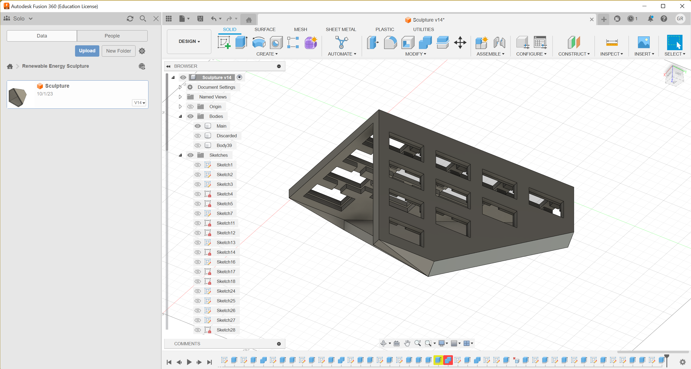


My original plan for painting the main 3D-printed body was the following:

1.	Sand a single flat surface (face) of the sculpture.
2.	Spray a layer of primer on the surface.
3.	Gently sand the primed surface.
4.	Repeat steps 2 and 3 twice more.
5.	Spray three coats of black paint on the surface.
6.	Spray three coats of chrome paint on the surface.

I tried this and let the paint dry for two days. However, when I picked up the sculpture, the paint was not dry and I ruined it with fingerprints, so I applied an additional coat of chrome paint and let it dry for five days. When I returned to pick it up, the same thing happened, resulting in a week-long delay. I am still in the process of painting the sculpture, though with more of a haphazard approach (involving a fair amount of improvisation, and thus being difficult to describe).

In parallel with these activities, I worked on the electronic circuitry, shown below. Following is a description of the various interconnected circuits taken directly from the draft of my thesis.

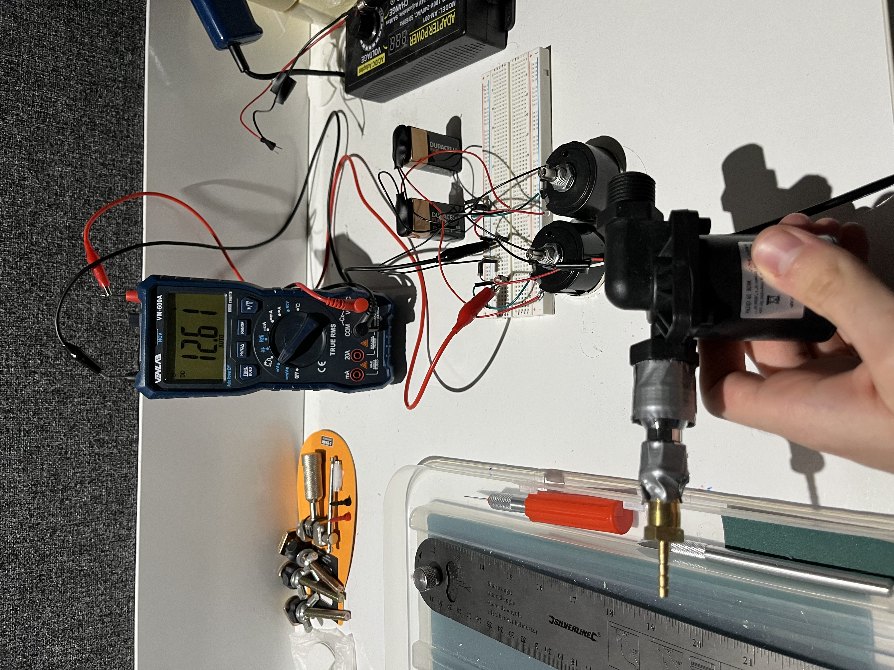

```↑ Voltage Regulator Circuit Powering a Water Pump```

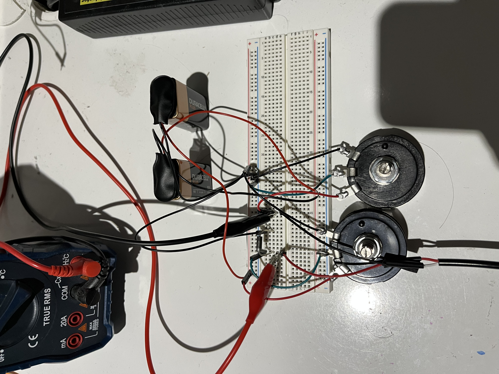

```↑ Voltage Regulator Circuit Powering a Water Pump```

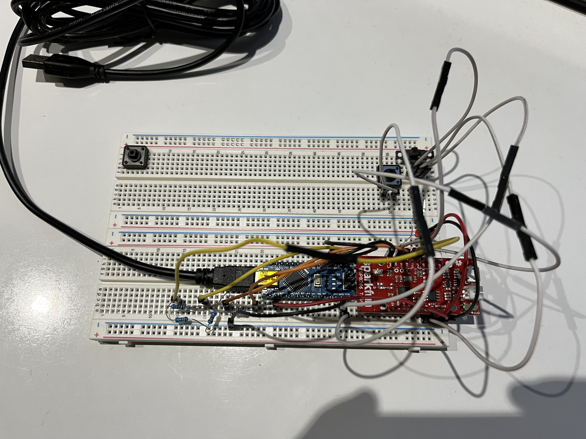

```↑ Testing and Maintenance Circuit for ESP8266 Thing```

**The following excerpt describes the expected final form of the system, which has not yet been completed. (More details below.)**

*There are two clusters of solar panels, one on each side of the sculpture. On one side, the panels are connected in series and power the water pump through a simple voltage regulator circuit. On the other side, they are connected in parallel and power a SparkFun ESP8266 Thing—the “brain” of the sculpture. The ESP8266 Thing reads the soil humidity through a hygrometer, and acts as an “on/off switch” for the pump via an electronic switch circuit. The pipe that connects the “back-end” system (electronic and mechanical components) to the inside of the sculpture enters the sculpture through an opening on the back. The system is hidden away some distance behind the sculpture for cosmetic purposes. There are a number of additional components shown in Figure 11, which displays the bare circuitry behind the sculpture. These additional components are there for testing and maintenance purposes, and are not necessary for the proper functioning of the device. They were left for potential future repairs and upgrades.*

The “additional components” in question are primarily used to upload code to the ESP8266 Thing, as it normally requires an FTDI controller which I did not have. I therefore had to built a contraption centred around an Arduino Nano to upload the code by proxy (I myself am uncertain about how exactly it works, but I was able to build it by combining what I learned from a handful of online tutorials).

The solar panels do not yet power anything; the ESP8266 Thing and its “support system” are powered by a USB cable, and the voltage regulator circuit powering the pump is powered by two 9 volt batteries. This last part warrants further comments, as it many challenges arose from this part of the system.

When the sculpture and its underlying systems are completed, the solar panels connected to the voltage regulator circuit powering the pump will output a current of 25mA, as per the specifications of the solar panels. However, when testing the system, I did not have the necessary hardware to emulate such a current. I first tried to use an AC to DC converter I owned from a previous project, but the current it generated was far too high and burned the Zener diode used in the circuit. I then switched to two 9 volt batteries, but the diode burned again. I wanted to purchase a diode with the same voltage specifications as the one I used but with a capacity to handle a higher wattage, but was unable to find one, so I ended up purchasing the closest thing I could find (12V instead of 11V). As a result, the testing circuit outputs a slightly higher voltage than that which the pump is rated to handle (its operating range is 6-12V), but it is able to tolerate the difference.

# Monday 6 November–Sunday 19 November

In my last entry, I mentioned that I struggled with high currents burning through the prototype of my circuit as I was not yet able to use my solar panels, which would have only outputted a maximum of 25mA. Instead, I was forced to use an AC to DC converter at first, and an array of 9V batteries next. The reason why I was unable to use the solar panels is that despite shining every light source I had at my disposition, the solar panels only outputted less than a volt. To solve this issue, I went all out and built a blindingly bright light setup centred around two 400W lights I assembled myself, shown in the images below. Plugging these lights into an outlet was fairly scary considering I was risking shocking myself with a lethal current, and my craftsmanship skills leave much to be desired. With this new light setup (which didn’t kill me), I was able to generate over 30 volts with my solar panels, which I was very pleased with.

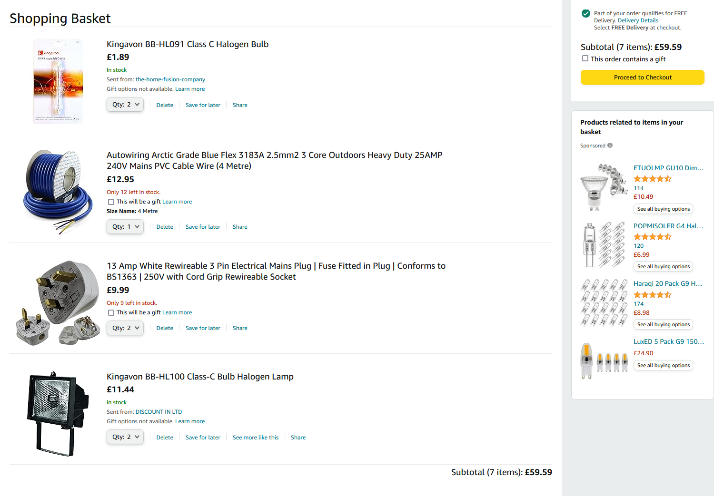
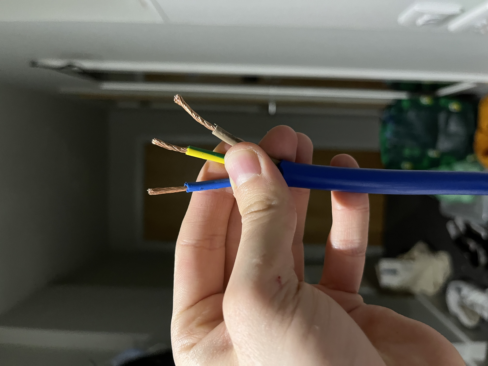
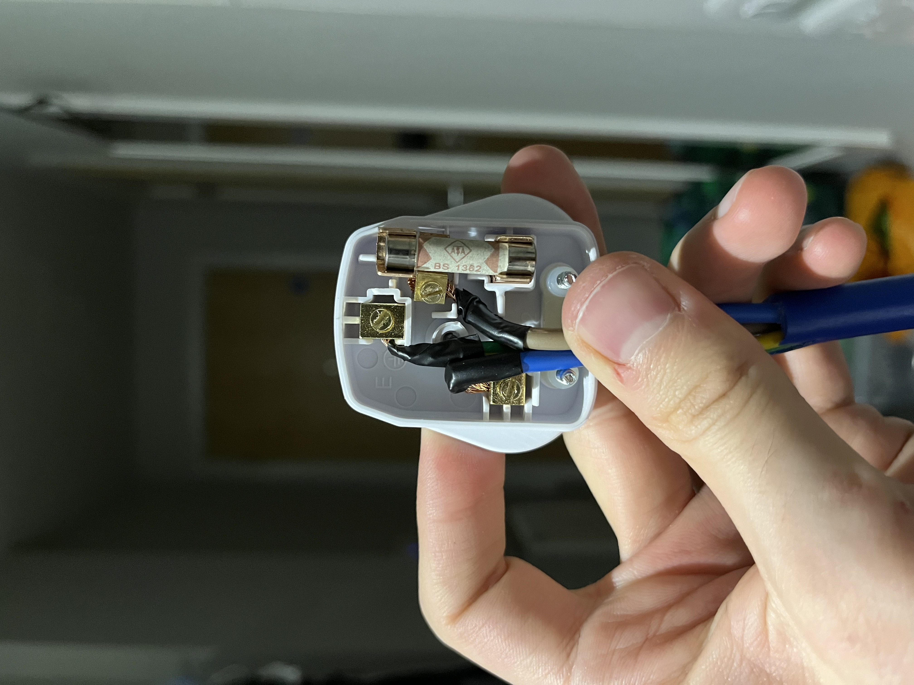
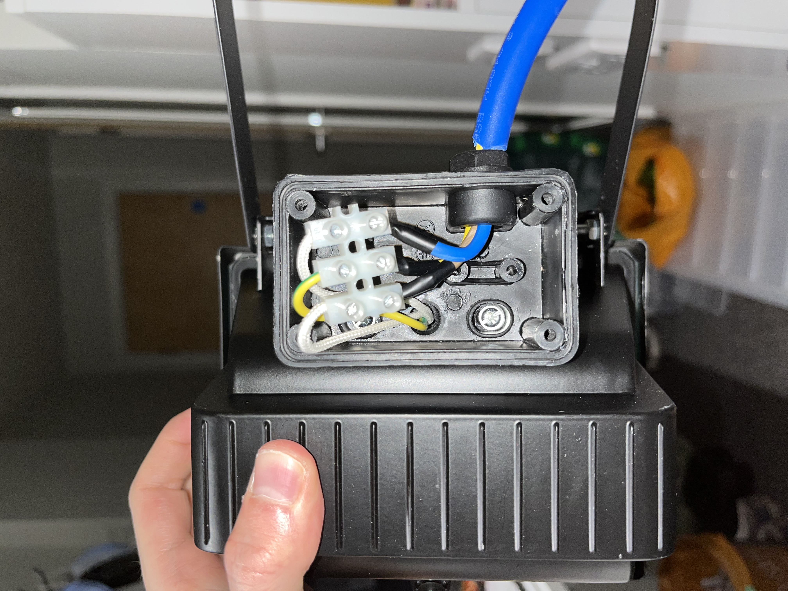
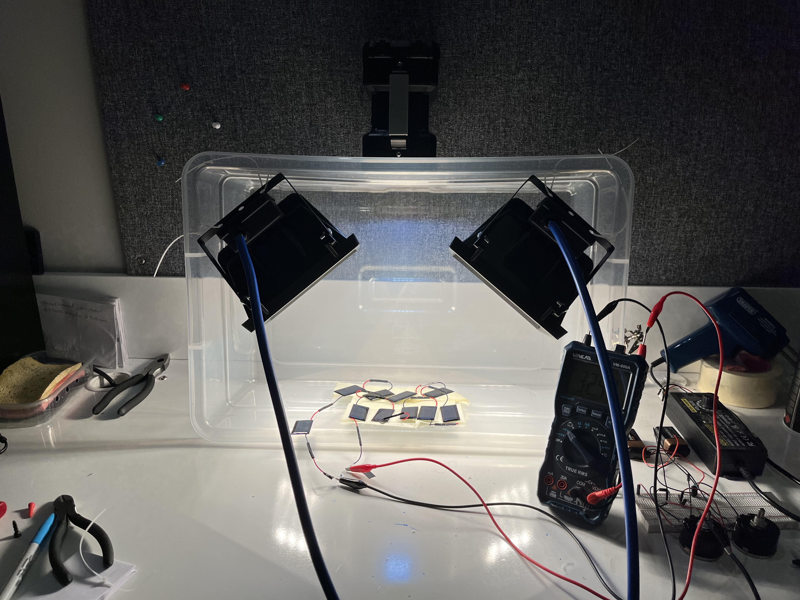
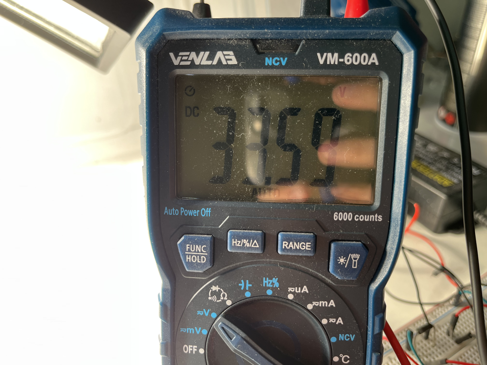

~~After getting my solar panels to work as intended, experimenting with the circuitry became far easier than before, considering the fact that I was no longer restricted to using components able to withhold high wattages. However, I made a stark realisation. I planned to have two separate arrays of solar panels to power both the ESP8266 Thing and its auxiliary component, and the water pumping and watering system. However, without special hardware, I realised that if I wanted to use the ESP8266 Thing as a switch for the water pump, they would have to share the same voltage source. This meant that I needed a kind of “double voltage regulator” circuit, which I struggled greatly to implement. With my deadline approaching fast, I decided to order ready-made voltage regulator circuits to lighten my workload. These are now in my possession but have not yet been used.~~ *Update (08/12/2023): This paragraph was based on a misunderstanding about electronic switch circuits. It significantly delayed my work but I rectified my mistakes and learned from it.*

# Monday 20 November–Friday 8 December

In my last entry, I explained that I planned to connect some buck converters (voltage regulators) to my solar panels. At the time, I had ten solar panels connected in series, producing over 30V. My plan was to divert appropriate voltages to my circuit and pump (circa 5V for the former, and 6-12V to the latter). However, when I attempted to implement my plan, I noticed that the buck converters failed. The input voltages, which were shown on seven-segment displays embedded onto the converters, would drop dramatically (along with the output voltages, obviously). After doing some research, I learned that this could happen when a circuit “attempted” to draw excessive current from a buck converter (that is, more current than the voltage source on the other end of the buck converter could supply). I therefore tried to configure my solar panels in a series-parallel configuration in order to achieve a balance of voltage and current. However, I made some mistakes when designing the new configuration, which led the solar panels to generate far too little of both voltage and current. Unaware of my mistakes, I decided to backtrack on my idea to use only ten solar panels (only one side of my sculpture) and introduced more panels, thinking it necessary (which may or may not have been the case in reality). After an extensive period of experimentation, I settled on a configuration of 18 panels, split into six groups of three. I connected each group of three in series, and connected all the groups in parallel. Theoretically, this configuration could now generate 15V and 125mA. When I connected the panels to my circuit without the pump, everything worked perfectly. However, when I introduced the pump to my circuit, the same issue I had first run into occurred again. After some more experimentation, I decided to buy a new, far smaller pump, which would draw very little current and hopefully work with my panels.

What followed was a sleepless few days of relentless wiring and rewiring, fuelled by coffee and false hopes. Thankfully, I did not give up, and finally achieved a functional circuit (which uses multiple voltage/current sources, which I had previously thought would not to be possible). A very brief demonstration of this circuit is shown in [this video](https://youtu.be/g7e_ZKtkRj0). [Another video](https://youtu.be/dLalpRrUAyI) was made following this demonstration, much longer this time, describing the circuit, as I did not believe I would have time to write an in-depth explanation in my blog (so I talked about it instead). This video contains a fair amount of stuttering, hesitation, and poor phrasing, as I made it at 4:45 AM on my third or fourth quasi-sleepless night (I lost count after the first).

To clear up a few things I did not communicate properly in the video:

* I chose the ESP8266 Thing microcontroller because its minimum input voltage is 3.3V, which is obviously quite low, and makes it a good fit for solar panels which are not always going to be outputting a high voltage (I briefly mention this in my thesis draft).
* The reason the electronic switch circuit supported by independent batteries works, and the electronic switch circuit connected directly to the pump doesn’t, has to do with a variation in base current requirements, since the pump consumes a relatively high amount of current.

After the circuit was completed, I mounted the solar panels and dripping tip onto my 3D-printed sculpture and made accompanying diagrams, shown below. I also made the rendition featured in my thesis with Blender, using almost exclusively self-made assets except the woman in the middle, which is an asset I purchased online.

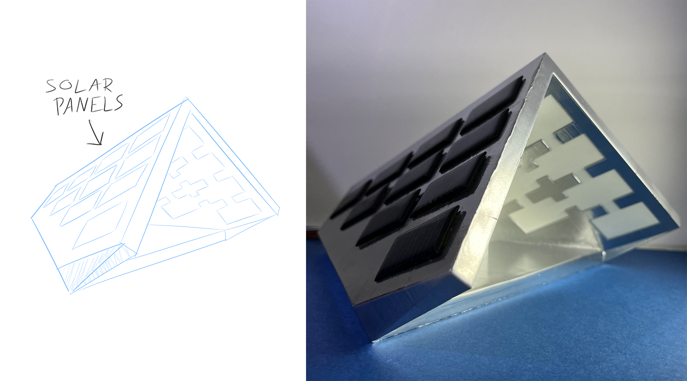
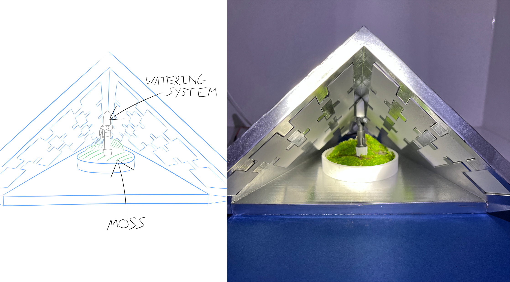
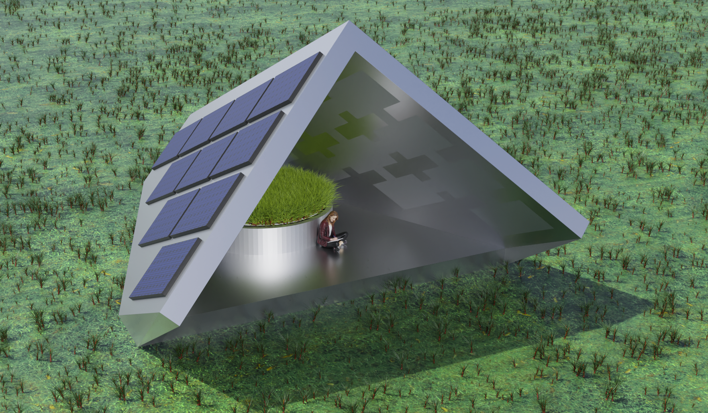
